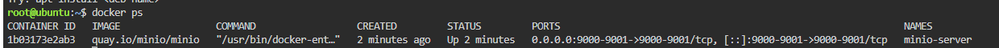
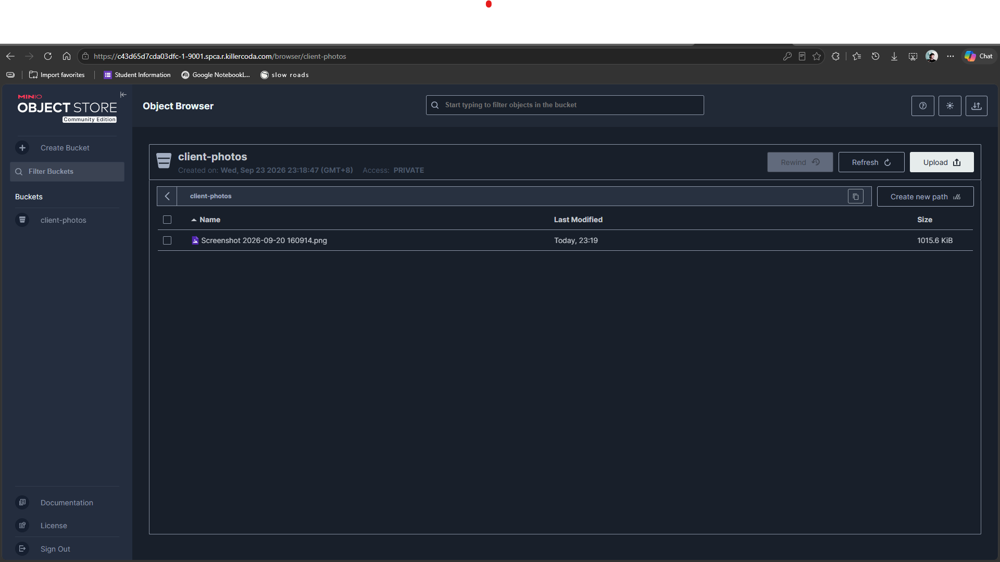

# MinIO S3-Compatible Object Storage Deployment

## Overview
This document outlines the technical steps performed to deploy an S3-compatible MinIO object storage server using Docker on a Linux environment, as well as accessing the management interface and creating a storage bucket.

---

## Deployment Configuration

### 1. Docker Execution Command
The MinIO container was launched using the following command:

```bash
docker run -d -p 9000:9000 -p 9001:9001 --name minio-server \
  -e "MINIO_ROOT_USER=cloudadmin" \
  -e "MINIO_ROOT_PASSWORD=CloudNova2026!" \
  quay.io/minio/minio server /data --console-address ":9001"
```

### 2. Parameter & Environment Variable (`-e`) Explanations
* `-d`: Runs the container in detached mode (background process)[cite: 1].
* `-p 9000:9000`: Maps port 9000 on the host to port 9000 in the container for S3 API requests[cite: 1].
* `-p 9001:9001`: Maps port 9001 on the host to port 9001 in the container for Web Console access[cite: 1].
* `--name minio-server`: Assigns a custom name to the running container[cite: 1].
* `-e "MINIO_ROOT_USER=cloudadmin"`: Environment variable that sets the administrative root username for accessing the MinIO console and API[cite: 1].
* `-e "MINIO_ROOT_PASSWORD=CloudNova2026!"`: Environment variable that sets the administrative root password required for authentication[cite: 1].
* `--console-address ":9001"`: Configures MinIO to serve the web interface explicitly on port 9001[cite: 1].

### 3. Port Mappings & Storage Setup
* **Console Port:** `9001`[cite: 1]
* **API Port:** `9000`[cite: 1]
* **Created Bucket Name:** `client-photos`[cite: 1]

---

## Deployment Verification Screenshots

### MinIO Container Status
[cite: 1]

### MinIO Bucket Creation and Upload
[cite: 1]